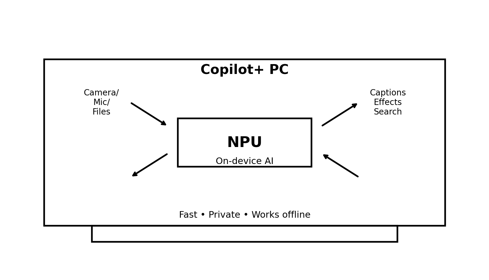
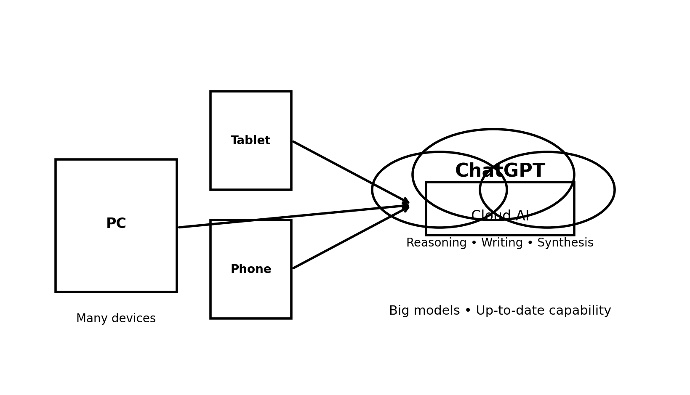
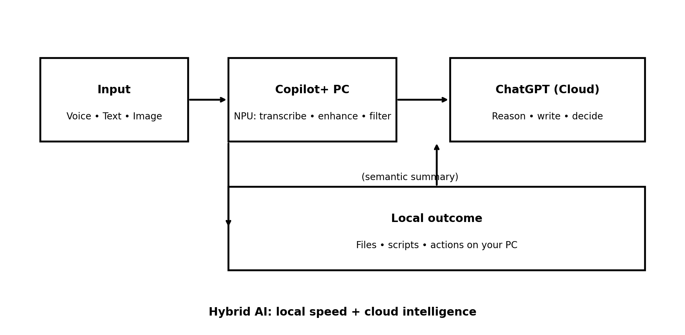

## Introduction {#introduction}

Microsoft’s Copilot+ PCs represent a major shift in personal computing: modern laptops now ship with dedicated **Neural Processing Units (NPUs)** designed to run artificial intelligence workloads directly on the device. At the same time, cloud-based AI systems like ChatGPT continue to evolve, offering deep reasoning, creativity, and continuously updated capability.

These two approaches are not competitors. They are complementary — and together they define the future of personal AI computing.

---

## What Is a Copilot+ PC? {#what-is-a-copilot-plus-pc}

A Copilot+ PC is a class of Windows 11 computers built around a dedicated NPU. Unlike CPUs and GPUs, which are general-purpose processors, an NPU is optimized specifically for machine-learning inference.

Typical NPU-powered capabilities include:

- Live captions and real-time transcription
- Image enhancement and background effects
- Eye-contact correction for video calls
- Semantic search over local files

Copilot+ PCs excel at **fast, private, repeatable AI tasks** that benefit from running directly on the hardware.

### Diagram: On-Device AI on the NPU {#diagram-on-device-ai}

---

## What Is ChatGPT? {#what-is-chatgpt}

ChatGPT is a cloud-based AI system designed for reasoning, synthesis, and creative problem-solving. Instead of running on a single device, it operates on large-scale infrastructure capable of supporting much larger models than would be practical on a laptop.

Key strengths include:

- Multi-step reasoning and analysis
- Long-context understanding across documents and conversations
- Creative writing and tone control
- Cross-domain synthesis (technical, legal, financial, and more)
- Continuously updated capability

ChatGPT focuses on **thinking and judgment**, not raw speed.

### Diagram: Cloud AI at Scale {#diagram-cloud-ai}

---

## Local AI vs Cloud AI {#local-vs-cloud-ai}

| Capability | Copilot+ PC (NPU) | ChatGPT (Cloud) |
|----------|------------------|-----------------|
| Latency | Near-instant | Network-dependent |
| Works offline | Yes | No |
| Privacy | Data stays local | Data processed remotely |
| Model size | Small to medium | Very large |
| Deep reasoning | Limited | Strong |
| Creativity & writing | Limited | Strong |
| Up-to-date knowledge | Fixed at install | Continuously updated |

This contrast sets the stage for **hybrid AI**.

---

## How They Work Together: Hybrid AI {#how-they-work-together}

The most powerful model combines **local execution** with **cloud intelligence**.

### Diagram: Hybrid Workflow {#diagram-hybrid-workflow}

In this model:

- The **NPU** handles immediacy, efficiency, and privacy-sensitive transforms (transcription, effects, local filtering)
- **ChatGPT** handles meaning, reasoning, writing, and decision support
- The results return to your PC for **local execution** (files, scripts, actions)

---

## Why This Matters in Practice {#why-this-matters}

For everyday users:

- AI feels instant and integrated
- Less battery drain for common AI features
- Better privacy by keeping more processing local

For professionals and power users:

- Complex documents drafted intelligently
- Technical and strategic reasoning on demand
- Writing that adapts to tone, audience, and intent

The result is AI that feels **useful instead of gimmicky**.

---

## The Future Is Hybrid {#the-future-hybrid-ai}

Purely local AI is constrained by hardware.
Purely cloud AI is constrained by latency, privacy, and connectivity.

Hybrid AI solves both: **local speed + cloud intelligence**.

Copilot+ PCs provide the reflexes.
ChatGPT provides the executive function.

Together, they form a complete system.

---

## Final Thoughts {#final-thoughts}

Copilot+ PCs make AI fast, efficient, and private.
ChatGPT makes AI thoughtful, expressive, and powerful.

Used together, they turn AI into a true computing layer — one that works *with* you, not just *for* you.
