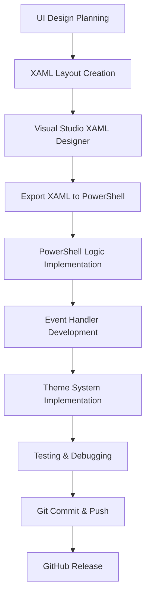

# WinUtil Technical Analysis: GUI Framework & Development Tools

> **In-depth Analysis of Chris Titus Tech's WinUtil PowerShell Application**  
> 🔗 Repository: [ChrisTitusTech/winutil](https://github.com/ChrisTitusTech/winutil)  
> 👨‍💻 Author: Chris Titus (@christitustech)  
> 🧵 Runspace Author: @DeveloperDurp  
> 📦 Version: 25.10.06  
> 📅 Analysis Date: November 6, 2025

## 📋 Table of Contents

- [Overview](#overview)
- [Core Technologies](#core-technologies)
- [GUI Framework Architecture](#gui-framework-architecture)
- [Development Tools Used](#development-tools-used)
- [Advanced Features](#advanced-features)
- [Technical Implementation](#technical-implementation)
- [Development Workflow](#development-workflow)
- [Code Examples](#code-examples)
- [Skills Required](#skills-required)
- [Conclusion](#conclusion)

## Overview

WinUtil is a sophisticated Windows utility application built entirely in PowerShell, demonstrating an innovative approach to creating professional desktop applications using native Windows technologies. The application showcases advanced PowerShell scripting combined with WPF (Windows Presentation Foundation) to deliver a modern, responsive GUI experience.

## Core Technologies

### Primary Framework Stack

| Technology | Purpose | Implementation |
|------------|---------|----------------|
| **PowerShell** | Core application logic and scripting | Single `.ps1` file containing all functionality |
| **WPF (Windows Presentation Foundation)** | GUI framework | Native Windows desktop application framework |
| **XAML** | UI definition and layout | Declarative markup for user interface design |
| **Windows Forms** | Dialog components | File/folder browser dialogs |
| **.NET Framework** | Runtime environment | Leverages .NET assemblies through PowerShell |

### Assembly Loading
```powershell
# Core WPF Framework
Add-Type -AssemblyName PresentationFramework

# Additional dialog components  
Add-Type -AssemblyName System.Windows.Forms
```

## GUI Framework Architecture

### XAML-Based User Interface

The application uses a sophisticated XAML definition embedded as a PowerShell here-string:

```powershell
$inputXML = @'
<Window x:Class="WinUtility.MainWindow"
        xmlns="http://schemas.microsoft.com/winfx/2006/xaml/presentation"
        xmlns:x="http://schemas.microsoft.com/winfx/2006/xaml"
        WindowStartupLocation="CenterScreen"
        UseLayoutRounding="True"
        WindowStyle="None"
        Width="Auto"
        Height="Auto"
        MinWidth="800"
        MinHeight="600"
        Title="WinUtil">
    <WindowChrome.WindowChrome>
        <WindowChrome CaptionHeight="0" CornerRadius="10"/>
    </WindowChrome.WindowChrome>
    <!-- Extensive XAML definition continues... -->
'@
```

### Runtime XAML Processing

```powershell
# Parse and load XAML at runtime
[xml]$XAML = $inputXML
$reader = (New-Object System.Xml.XmlNodeReader $xaml)
$sync["Form"] = [Windows.Markup.XamlReader]::Load($reader)

# Bind named controls to PowerShell variables
$xaml.SelectNodes("//*[@Name]") | ForEach-Object {
    $sync["$($psitem.Name)"] = $sync["Form"].FindName($psitem.Name)
}
```

## Development Tools Used

### 🛠️ Primary Development Environment

#### **Code Editors**
- **Visual Studio Code** with PowerShell extension (most likely)
  - IntelliSense for PowerShell
  - Integrated terminal
  - Git integration
  - Extension ecosystem
- **PowerShell ISE** (alternative)
  - Built-in PowerShell development environment

#### **XAML Design Tools**
- **Visual Studio 2019/2022** (Community/Professional)
  - Visual XAML designer
  - IntelliSense for XAML properties
  - Live preview capabilities
  - Blend integration
- **Blend for Visual Studio** (possible)
  - Professional UI design tool for WPF
  - Advanced styling and animation capabilities
  - Visual state management

#### **Alternative XAML Tools**
- **XAMLPad** - Lightweight XAML testing
- **Kaxaml** - Simple XAML editor and viewer
- **XAML Designer** - Visual layout design

### 🎨 Design and Planning Tools

#### **UI/UX Design**
- **Figma** / **Adobe XD** / **Sketch**
  - Design mockups and prototypes
  - Color scheme planning
  - Layout specifications
- **Windows Design Guidelines**
  - Fluent Design System principles
  - Accessibility considerations

#### **Version Control**
- **Git** with **GitHub**
  - Repository: https://github.com/ChrisTitusTech/winutil
  - Collaborative development
  - Release management
  - Issue tracking

## Advanced Features

### 🧵 Multi-Threading Architecture

```powershell
# Runspace pool for background operations
$maxthreads = [int]$env:NUMBER_OF_PROCESSORS
$InitialSessionState = [System.Management.Automation.Runspaces.InitialSessionState]::CreateDefault()

# Create runspace pool
$sync.runspace = [runspacefactory]::CreateRunspacePool(
    1,                      # Minimum thread count
    $maxthreads,            # Maximum thread count  
    $InitialSessionState,   # Initial session state
    $Host                   # Machine to create runspaces on
)

# Execute background tasks
function Invoke-WPFRunspace {
    $script:powershell = [powershell]::Create()
    $script:powershell.AddScript($ScriptBlock)
    $script:powershell.RunspacePool = $sync.runspace
    $script:handle = $script:powershell.BeginInvoke()
}
```

### 🎨 Dynamic Theme System

```powershell
# Theme switching functionality
function Set-WinutilTheme {
    param([string]$currentTheme)
    
    function Set-ThemeResourceProperty {
        param($Name, $Value, $Type)
        
        switch ($Type) {
            "ColorBrush" { 
                $sync.Form.Resources[$Name] = [Windows.Media.BrushConverter]::new().ConvertFromString($Value)
            }
            "Color" {
                $sync.Form.Resources[$Name] = [Windows.Media.ColorConverter]::new().ConvertFromString($Value)  
            }
            # Additional type handlers...
        }
    }
}

# Automatic system theme detection
$sync.Form.Add_Loaded({
    $interopHelper = New-Object System.Windows.Interop.WindowInteropHelper $sync.Form
    $hwndSource = [System.Windows.Interop.HwndSource]::FromHwnd($interopHelper.Handle)
    $hwndSource.AddHook({
        # Listen for Windows theme change events
        # Update application theme accordingly
    })
})
```

### 🎯 Event-Driven Architecture

```powershell
# Automatic event binding for UI controls
$sync.keys | ForEach-Object {
    if($sync.$psitem) {
        if($($sync["$psitem"].GetType().Name) -eq "Button") {
            $sync["$psitem"].Add_Click({
                [System.Object]$Sender = $args[0]
                Invoke-WPFButton $Sender.name
            })
        }
    }
}
```

## Technical Implementation

### 🏗️ Application Structure

```
WinUtil Architecture
├── 📄 Single PowerShell Script (winutil.ps1)
├── 🎨 Embedded XAML UI Definition  
├── 🔧 PowerShell Functions Library
├── 🧵 Multi-threaded Runspace System
├── 🎭 Dynamic Theming Engine
├── 📦 Configuration Management
└── 🔗 Windows API Integration
```

### 🔄 Data Synchronization

```powershell
# Synchronized hashtable for cross-thread communication
$sync = [Hashtable]::Synchronized(@{})
$sync.PSScriptRoot = $PSScriptRoot
$sync.version = "25.10.06"
$sync.configs = @{}
$sync.ProcessRunning = $false
$sync.selectedApps = [System.Collections.Generic.List[string]]::new()
```

### 🖼️ Custom Styling System

```xml
<!-- Dynamic resource-based styling -->
<Style TargetType="ToolTip">
    <Setter Property="Background" Value="{DynamicResource ToolTipBackgroundColor}"/>
    <Setter Property="Foreground" Value="{DynamicResource MainForegroundColor}"/>
    <Setter Property="BorderBrush" Value="{DynamicResource BorderColor}"/>
    <Setter Property="MaxWidth" Value="{DynamicResource ToolTipWidth}"/>
</Style>

<Style x:Key="AppEntryBorderStyle" TargetType="Border">
    <Setter Property="BorderBrush" Value="Gray"/>
    <Setter Property="CornerRadius" Value="5"/>
    <Setter Property="Background" Value="{DynamicResource AppInstallUnselectedColor}"/>
</Style>
```

## Development Workflow

### 📋 Likely Development Process



### 🔄 Iterative Development Steps

1. **Design Phase**
   - Create UI mockups and wireframes
   - Plan color schemes and layouts
   - Define user interaction flows

2. **XAML Development**
   - Build UI layout in Visual Studio designer
   - Create custom styles and templates
   - Test responsive behavior

3. **PowerShell Integration** 
   - Embed XAML as here-string
   - Implement business logic functions
   - Create event handlers

4. **Advanced Features**
   - Add multi-threading support
   - Implement theme system
   - Add Windows integration

5. **Testing & Polish**
   - Test on multiple Windows versions
   - Handle edge cases and errors
   - Performance optimization

## Code Examples

### 🎨 Theme Resource Management

```powershell
# Dynamic theme property setting
$selectedAppLabel.SetResourceReference([Windows.Controls.Control]::ForegroundProperty, "MainForegroundColor")
$selectedAppRemoveButton.SetResourceReference([Windows.Controls.Control]::StyleProperty, "HoverButtonStyle")

# Color animation on hover
$selectedAppRemoveButton.Add_MouseEnter({ 
    $this.SetResourceReference([Windows.Controls.Control]::ForegroundProperty, "ErrorColor") 
})
$selectedAppRemoveButton.Add_MouseLeave({ 
    $this.SetResourceReference([Windows.Controls.Control]::ForegroundProperty, "MainForegroundColor") 
})
```

### 🔧 Background Task Management  

```powershell
# Execute long-running operations without blocking UI
Invoke-WPFRunspace -ScriptBlock {
    try {
        $ProgressPreference = "SilentlyContinue"
        $sync.ConfigLoaded = $False
        $sync.ComputerInfo = Get-ComputerInfo
        $sync.ConfigLoaded = $True
        
        # Update UI from background thread
        [System.Windows.Forms.Application]::DoEvents()
    }
    finally {
        $ProgressPreference = $oldProgressPreference
    }
}
```

### 🎯 Custom Control Creation

```powershell
# Dynamically create styled UI elements
$border = New-Object Windows.Controls.Border
$border.Style = $sync.Form.Resources.AppEntryBorderStyle

$checkBox = New-Object Windows.Controls.CheckBox  
$checkBox.Style = $sync.Form.Resources.AppEntryCheckboxStyle

$textBlock = New-Object Windows.Controls.TextBlock
$textBlock.Style = $sync.Form.Resources.AppEntryNameStyle
```

## Skills Required

### 🎓 Technical Expertise

| Skill Area | Level | Details |
|------------|-------|---------|
| **PowerShell Scripting** | Expert | Advanced features: runspaces, .NET integration, error handling |
| **WPF/XAML Development** | Advanced | Layout design, styling, data binding, event handling |
| **Windows Development** | Intermediate | Windows APIs, system integration, theme detection |
| **UI/UX Design** | Intermediate | Modern interface design, accessibility, responsive layouts |
| **.NET Framework** | Intermediate | Assembly loading, type conversion, resource management |
| **Git/GitHub** | Basic | Version control, collaboration, release management |

### 🏆 Advanced Concepts Demonstrated

- **Cross-thread communication** using synchronized hashtables
- **Runtime XAML parsing** and control binding
- **Dynamic resource management** for theming
- **Windows message handling** for system integration
- **Runspace pooling** for performance optimization
- **Professional error handling** and logging
- **Single-file deployment** strategy

## Conclusion

### 🌟 Innovation Highlights

WinUtil represents a **groundbreaking approach** to Windows desktop application development:

1. **Pure PowerShell Implementation** - No C# or traditional .NET development required
2. **Professional UI/UX** - Rivals applications built with traditional development tools  
3. **Modern Architecture** - Multi-threading, theming, and responsive design
4. **Zero Installation** - Runs on any Windows system with PowerShell
5. **Single File Distribution** - Entire application in one `.ps1` file

### 🎯 Key Takeaways

- **Demonstrates PowerShell's versatility** beyond simple scripting
- **Proves feasibility** of complex GUI applications in PowerShell
- **Showcases professional development practices** in script-based applications
- **Provides template** for similar utility development
- **Bridges gap** between traditional development and system administration

### 🚀 Development Impact

This application serves as an **excellent reference** for:
- System administrators wanting to create GUI tools
- PowerShell developers exploring WPF integration
- Anyone interested in rapid Windows application development
- Developers seeking single-file deployment solutions

---

*This analysis demonstrates that with the right tools and expertise, PowerShell can be used to create sophisticated, professional desktop applications that rival those built with traditional development frameworks.*

## 📚 Additional Resources

- [WinUtil GitHub Repository](https://github.com/ChrisTitusTech/winutil)
- [Chris Titus Tech YouTube Channel](https://www.youtube.com/@ChrisTitusTech)
- [Microsoft WPF Documentation](https://docs.microsoft.com/en-us/dotnet/desktop/wpf/)
- [PowerShell Documentation](https://docs.microsoft.com/en-us/powershell/)
- [XAML Overview](https://docs.microsoft.com/en-us/dotnet/desktop/wpf/xaml/)

---

**Created**: November 6, 2025  
**Analysis Version**: 1.0  
**WinUtil Version Analyzed**: 25.10.06